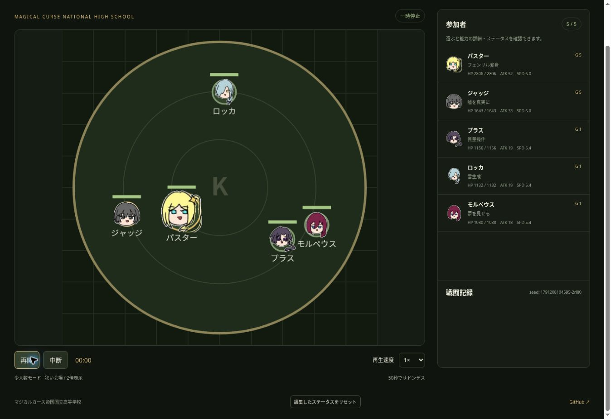

# カス校バトルロワイヤル

[ginghum/battle](https://github.com/ginghum/battle) の円形フィールド、接触戦闘、縮小、倍速の操作を引き継いだカス校専用シミュレーターです。[カス校名鑑](https://ginghum.github.io/START/)の93人の能力を、新しい戦闘エンジンに個別実装しました。

## 遊び方

1. 2〜60人をカンマ・読点・改行で入力。
2. 「バトル開始」で最後の一人まで戦闘。終了画面で参加者のキル数トップ5を表示します（5人未満なら全員、同数は同順位、表示は最大5人）。脱落者も対象、召喚物は対象外。引き分け・時間切れでも表示します。生き残りランキングも最大5人表示し、生存者が上位、脱落者は脱落時刻が遅い順です。同時脱落・時間切れの生存者同士は同順位。名前・顔アイコン・生存時間を表示します。
3. 参加者を選ぶと能力の説明・ステータスを確認できます。編集は次の試合から適用されます。

ニックネーム・本名のどちらでも固定の能力と基礎値になります。X／Ｘ／エックスにも対応。名鑑にない名前は、名前から93種類のカス校能力のいずれかを固定割り当てし、基礎値は全員 **ATK 18 / HP 1250 / SPD 5.5** です。参加者の組み合わせや順番によって自由入力の能力は変わりません。

「ランダム20人」「ランダム60人」「ランダム5人」「生徒会全員（ミルクを除く12人）」、検索できる名鑑選択があります。Grade 1〜5それぞれからランダムに5人を選ぶボタンも用意しています。すべてのランダム選択はエンプレスを候補から外します。0.5〜8倍速・一時停止・中断・再試合に対応。同じ参加者順・試合シード・編集値・サドンデス・共通能力設定なら同じ結果を再現します。「全員の能力を揃える」で能力を選び「全員に適用」を押すと、そのページ内で全参加者の能力だけを一時的に統一します。参加者の変更や再試合にも適用され、攻撃力・HP・SPDと個別の保存値は維持。「解除」か再読み込みで元の能力（個別編集があればその能力）へ戻ります。共通設定中は個別の能力変更を無効にし、数値だけ編集できます。空欄のシードは毎回ランダムで生成し、戦闘記録欄に表示します。Spaceで一時停止。タブが隠れると自動で一時停止します。

## 設定とゲームへの翻訳

- 参照は START の `characters-data/*/profile.json`、2026-10-05時点の93人。ニックネーム、本名、Grade、所属、身長、能力を参照しました。元データのコミットと各ファイルのSHAは `source-snapshot.json` に記録しています。
- **戦闘数値は公式設定ではなく推定値**。Grade・体格を基準に、イトグチ、エンプレス、マイナス、タイタンなどの記述された実力、低Gradeでも決闘の強いランスなどを個別補正しました。
- 能力は元の汎用スキルの名前変更ではなく、専用の効果・持続時間・条件を実装しています。同じ質量操作でもプラスは構えの切り替え、マイナスは広い対象制御と重量攻撃に分けています。
- エンプレスは既に獲得した能力の代表として硬質化・反射・治癒・斥力を持ちます。自分が倒した本体から能力を獲得し、重複しません。獲得時の攻撃規模はコピー元から固定し、その後コピー元が変わっても追従しません。原作の膨大な全能力を網羅したものではありません。
- ミューはダイヤ兵を最大1体作り、ダイヤの盾と結晶弾も扱います。
- タナカはHP55%未満で自身を健康な普通の状態へ戻します。再使用10秒。HP0からは復活しません。相手の能力を無効化する能力にはしていません。
- オーガは他者だけを強化します。個人戦で味方がいない場合は肉体で戦います。自身の能力強化はしません。
- モルペウスの能力は眠っている相手にだけ有効です。全員共通のゲームルールとして、HP25%未満で12秒ごとに1.2秒休息し、その時に夢を長引かせます。覚醒中の敵を能力だけで眠らせません。
- ツクリは会場に用意された補給箱を開けて防具を調達します。拘束全般を「解錠」で解除しません。ベル・ロマンチ・ダンカチも、準備した材料や道具を使う想定です。物を無条件に生成する能力にはしていません。
- 非戦闘能力は索敵、偽装、道具の運用などへ翻訳。ゲームの具体的効果は各参加者の詳細に表示します。性格による味方扱いや固有の人間関係は戦闘ロジックに入れていません。
- 開始人数に応じて自動で会場と表示サイズを調整。5人以下は少人数モード（半径185、2倍表示）、6〜20人は中人数モード（半径250、1.5倍表示）、21人以上は通常モード（半径385、等倍表示）。キャラ・弾・範囲・エフェクト・名前をまとめて拡大します。途中の脱落による切り替えはありません。戦闘上の当たり判定やキャラの数値は拡大しません。
- サドンデスは試合前にオン・オフ設定可能（初期値オン、保存対象）。オンでは50秒で攻撃10倍・移動3倍。180秒で決着しなければ「決着なし」。全員脱落は引き分け。回復・無敵には有限の再使用間隔を設けています。

## ファイルと実行

静的HTML / CSS / JavaScriptのみ。ビルド・外部UIライブラリ・バックエンドは不要です。キャラの顔アイコンはユーザー提供の手描き一覧画像を参照します。元画像は `assets/character-sheet.jpg` に保存し、`icons.js` の顔領域と輪郭クリップで名前の文字を除いて表示します。ジャッジとジェンドは共通の顔です。参加者一覧・名鑑・戦闘・勝者表示で使用。画像が読み込めなくても戦闘は動きます。

```sh
python -m http.server 8000
# http://localhost:8000 を開く
node tests/engine.cjs
npm install
npm run test:ui
```

- `data.js`: 全93人・別名・基礎数値・能力説明
- `engine.js`: 固定60fpsの戦闘計算。Nodeでも実行可能
- `app.js`: 入力・描画・編集・名鑑選択・保存
- `icons.js`: 全93キャラの顔の表示領域・輪郭クリップ
- `style.css` / `index.html`: レスポンシブ画面
- `tests/engine.cjs`: 全キャラ／別名、固有効果、60人、シード再現、エフェクト上限
- `tests/ui.cjs`: jsdomで入力、検索、編集、上限、一時停止、8倍速、再試合を検証

Canvas内のエフェクトはシミュレーション時間で消え、件数も制限します。終了時にエフェクト・弾・ゾーンを消去。召喚者の脱落で支援者は停止し、死亡した召喚のデータも毎フレーム除去します。画面の倍速を変えても戦闘計算の刻み幅は変えません。

## GitHub Pages

リポジトリの **Settings → Pages → Deploy from a branch → main / (root)** を選択すると、`https://ginghum.github.io/kasubato/` で公開できます。このコードの作成だけではPages設定は変更されません。

## 検証

エンジンテスト、93人全別名、60人の再現試合、jsdomでの操作と8倍速3連続試合が通過。公開版Chromeで、顔アイコンの参加者一覧・少人数モードの戦闘・名鑑93人の表示を確認しました。Grade 5の指定19人は、全員参加の対戦とランダム20人の対戦を繰り返し、勝率を近づける調整を行いました。結果と手順は `balance/grade5/report.md` を参照してください。このGrade 5調整時点ではエンプレス・イトグチを含む対象外74人のデータは変更していません。その後、生徒会全員からエンプレスを除いた11人の試合でイトグチの勝率を約30%に近づけるため、イトグチのATKのみ60→85に強化しました。HP・SPD・能力の効果と再使用間隔、他キャラの数値は維持しています。検証条件・結果は `balance/itoguchi/report.md`、再現スクリプトは `scripts/simulate-itoguchi.cjs` を参照してください。 続いてエンプレス入りGrade 5全22人戦の勝率95〜99%を目標に、エンプレスのHPのみ3300→1600へ変更しました。ATK 62・SPD 6.5・防御・回復・能力獲得の仕組みは維持しています。結果・条件は `balance/empress/report.md`、再現スクリプトは `scripts/simulate-empress.cjs` を参照してください。



## Grade 4の調整

Grade 4の15人は、全員参加の15人戦とランダム5人戦で勝率の偏りを調べ、ATK・HPのみを調整しました。能力の効果・再使用間隔・SPDと、他Gradeの78人のデータは変更していません。戦闘数値の変更は混合Gradeの試合にも適用されます。サドンデスありの最終確認は全員戦1500試合で各2.1〜11.8%、ランダム5人戦1800試合で各参加時12.3〜30.6%。結果と再現方法は `balance/grade4/report.md`、再現コマンドは `npm run simulate:grade4 -- 1000 grade4-validation-v1 all`（5人戦は末尾を `five`）を参照してください。
